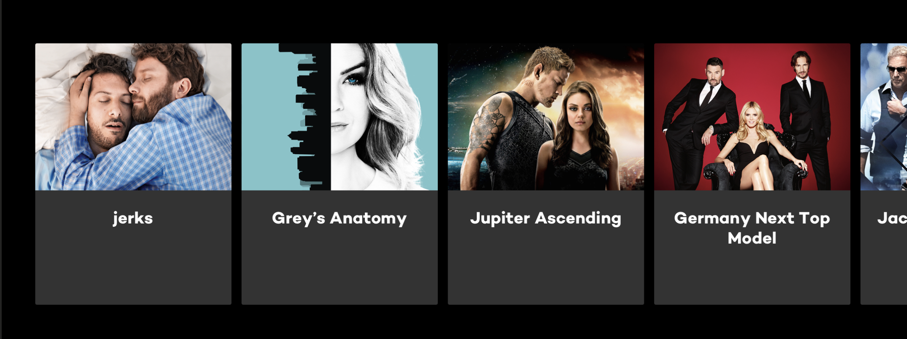

This is a [Next.js](https://nextjs.org/) project bootstrapped with [`create-next-app`](https://github.com/vercel/next.js/tree/canary/packages/create-next-app).

## Getting Started

First, run the development server:

```bash
npm run dev
# or
yarn dev
```

Open [http://localhost:3000](http://localhost:3000) with your browser to see the result.

## Your task

Your task is to implement a web application that includes 2 kind of pages:

### 1. A list of movies

The layout should consist of multiple lanes with cards. Each card should have a teaser image and title image (or, if no image available, text as a fallback). An example app could look like this:


### 2. A detail page

Once clicking on a lane title, a detail page should open.
The layout should include a backdrop image, the movie title, tagline, info about adult content, the spoken languages and a lane with recommended movies.

An example app could look like this:


### Data Sources

For the purpose of this assignment, you can use the [existing GraphQL API](https://web-coding-challenge.vercel.joyn.de/api/graphql), also available in the repo as `/api/graphql`.
A sample query to fetch the relevant data could be:

```graphql
query {
  blocks {
    id
    headline
    assets {
      title
    }
  }
}
```

Feel free to use the Playground to explore the schema and optimize the query.

As a emergency fall-back, you also can use the rest endpoints
[`/api/blocks`](https://web-coding-challenge.vercel.joyn.de/api/blocks) and [`/api/block/[id]`](https://web-coding-challenge.vercel.joyn.de/api/block/[id]), but we encourage you to try GraphQL instead.

If you replace `profile:nextgen-web-heroportrait-243x365` within your images, you can use different profiles:
- `profile:nextgen-web-herolandscape-1920x`
- `profile:nextgen-webphone-heroportraitcut-563x780`

### Some features that will impress us

- The pages should be rendered/pre-generated on the server
- Card focusing should be animated
- Lane scrolling should be animated
- Consider the architecture of the lane like it can contain 1000 of items (or even more)
- Be creative! 🙂

## Questions

Please ask any questions, if something is not understandable. Just open a new issue and state your question, we will try and respond to you as soon as possible.

## Tips

- Tests are nice, but it's up to you what should be covered
