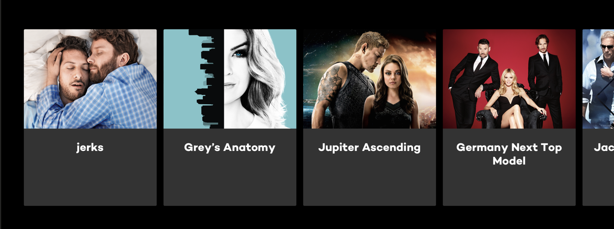
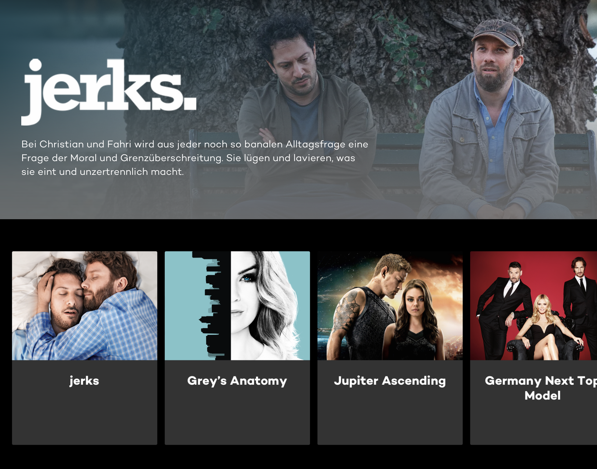

## JOYN SERIES APP TASK

The task was to implement a web application that includes 2 kind of pages:

### 1. A list of movies

The layout should consist of multiple lanes with cards. Each card should have a teaser image and title image (or, if no image available, text as a fallback). An example app could look like this:

### 2. A detail page

Once clicking on a lane title, a detail page should open.
The layout should include a backdrop image, the movie title, tagline, info about adult content, the spoken languages and a lane with recommended movies.

An example app could look like this:

[Akua Appiah-Lindberg](mailto:appiah-lindberg@outlook.com)

### [Click here to see the Video Review]([LINK_TO_LOOM_VIDEO])

## Proposed Solution
- The first step was to ensure the server was running few enhancements were made to run server
- The schema and typedefs were removed from the server to separate concerns and a separate folder was created to contain them
- Types were created for the various schemas already defined to ensure type safety
- With schema resolvers and types ready the server was run on localhost:3000/api/graphql to check all queries to ensure they worked
- the home page was created accessing the data from the server with the help of react useQuery hook
- the blocks were iteredted on to the access the assets and that was further iterated on to access the individual series
- the server was enhanced with a new resolver and query for the creation of a detailed page
- a detailed sereis page was created to show further details once one of the series on the list were clicked
- with the help of next link, navigation to the details page was established
- end to end tests were created 
- the app was deployed on netlify the first choice was vercel but for that the repo would need to be public 

### [Click here to see the Live Demo]([LINK_TO_THE_DEPLOYED_APP])

## Screenshots

## Assumptions
The API would complete and as needed for the development of the UI

## Libraries / Tools Used

- React.js
- Create Next App for project setup
- ApplloClient
- Typescript
- Vercel for deployment
- ApolloServer
- GraphQL
- GraphQL playground
- Cypress

## Setup

To install the dependencies run:

`npm install`

And to run the app:

`npm run dev`

## Running the tests

You can run the unit tests using:

`npm test`

## Challenges
1. Time constraints - getting a very beautiful UI which is really impressive needs a lot of time
2. Data integrity - a lot oftime was spent trying several ways to be able to render a detailed page of an asset when it is clicked on as a           reccommended one fromanother assets's details there were two main challeges
   1. the acessing had to be something unique to each reccomended asset or else the detailed page suddenly had several reccomded asset that were the same this was the case whenever the id was used
   2. other information that proved unique to the reccomended asset was not optial for using for the assets generally and since in order to route to the detailed page it had to be the same attribute this functionality had to be left out
## Future Work

1. Complete test coverage to achieve 90%
2. Create more uint tests
3. Improve styling and responsive design
4. Test for perfomance and consider setting up a CDN
5. Consider using CSS in JS for styling 
6. Enhance data integrity to make assesing for the UI easier especially navigating 

